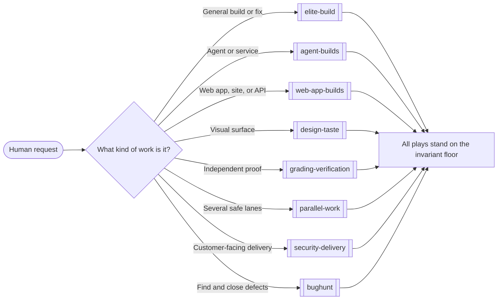
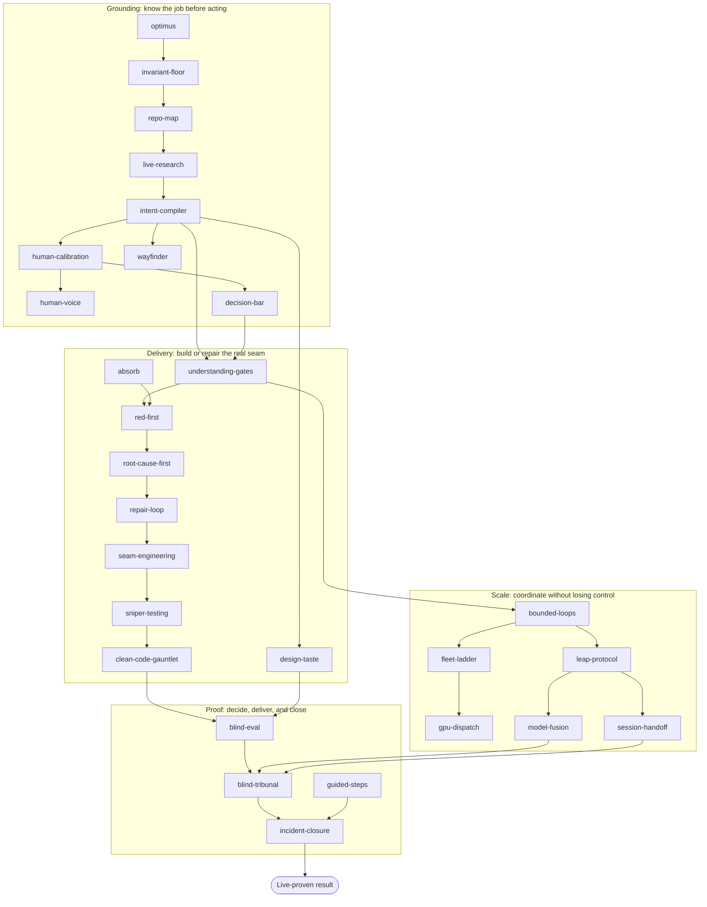
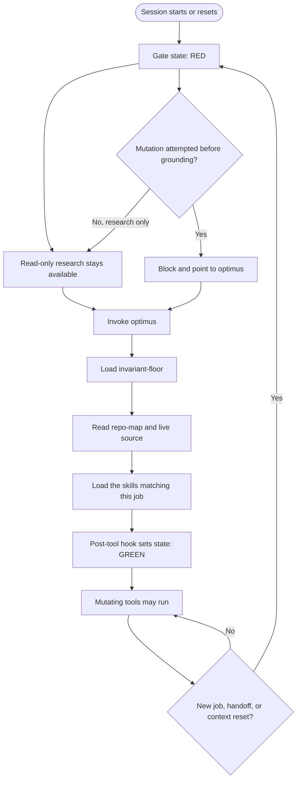
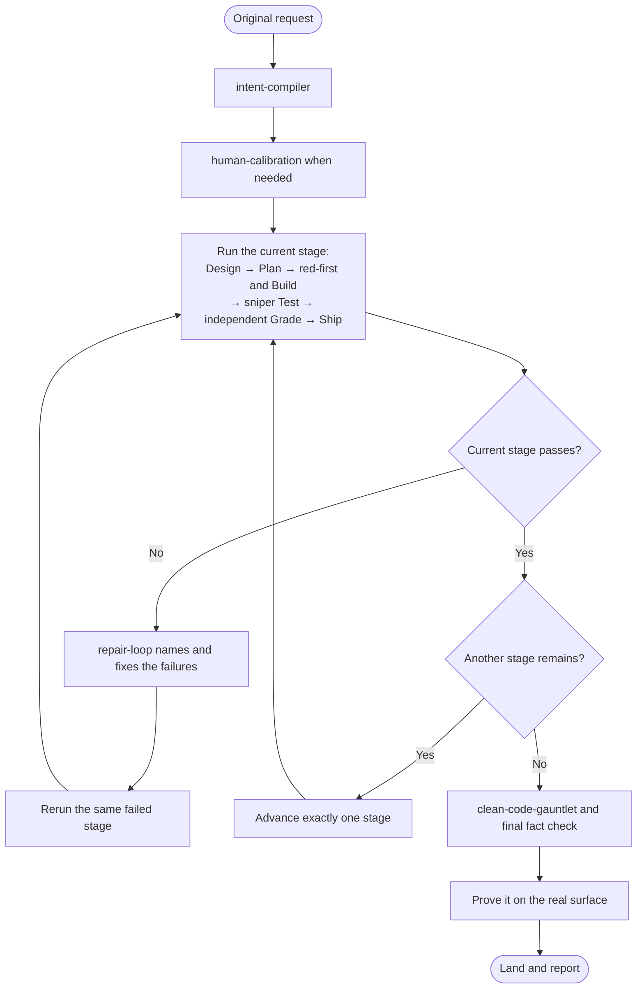
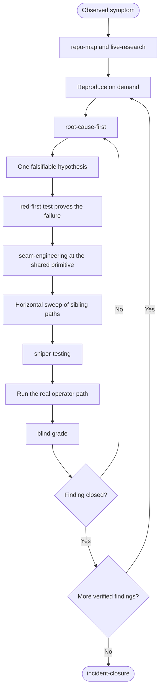
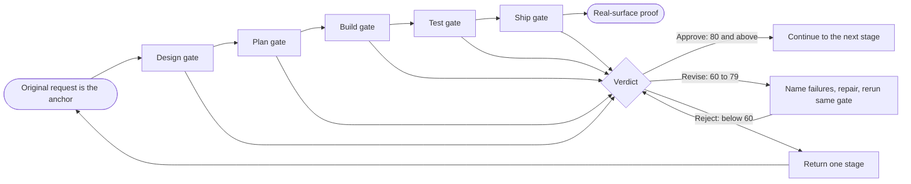
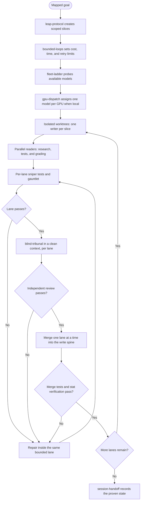
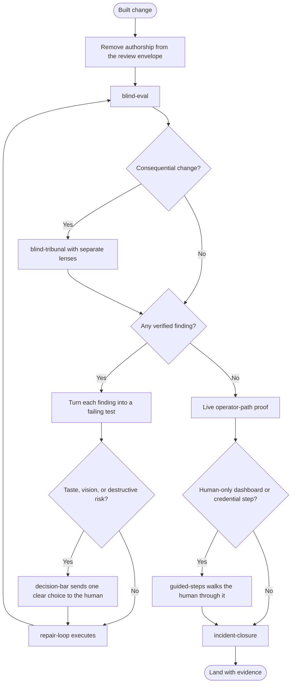

# BACKS AIOS visual guide

These diagrams show how the pack moves from a human request to verified delivery.
They are maps, not extra rules. The linked skill and play files remain the source of
truth.

Mermaid renders directly on GitHub and in many IDEs. Every chart also has a **Text
version** for terminals, screen readers, and Markdown viewers without Mermaid.
Shapes carry meaning so the guide never depends on color:

- rounded box: start or finish;
- rectangle: action or skill;
- diamond: decision or gate;
- double-sided box: named play.

## Quick links

**Skills:** [absorb](../skills/absorb/SKILL.md) ·
[blind-eval](../skills/blind-eval/SKILL.md) ·
[blind-tribunal](../skills/blind-tribunal/SKILL.md) ·
[bounded-loops](../skills/bounded-loops/SKILL.md) ·
[clean-code-gauntlet](../skills/clean-code-gauntlet/SKILL.md) ·
[decision-bar](../skills/decision-bar/SKILL.md) ·
[design-taste](../skills/design-taste/SKILL.md) ·
[fleet-ladder](../skills/fleet-ladder/SKILL.md) ·
[gpu-dispatch](../skills/gpu-dispatch/SKILL.md) ·
[guided-steps](../skills/guided-steps/SKILL.md) ·
[human-calibration](../skills/human-calibration/SKILL.md) ·
[human-voice](../skills/human-voice/SKILL.md) ·
[incident-closure](../skills/incident-closure/SKILL.md) ·
[intent-compiler](../skills/intent-compiler/SKILL.md) ·
[invariant-floor](../skills/invariant-floor/SKILL.md) ·
[leap-protocol](../skills/leap-protocol/SKILL.md) ·
[live-research](../skills/live-research/SKILL.md) ·
[model-fusion](../skills/model-fusion/SKILL.md) ·
[optimus](../skills/optimus/SKILL.md) ·
[red-first](../skills/red-first/SKILL.md) ·
[repair-loop](../skills/repair-loop/SKILL.md) ·
[repo-map](../skills/repo-map/SKILL.md) ·
[root-cause-first](../skills/root-cause-first/SKILL.md) ·
[seam-engineering](../skills/seam-engineering/SKILL.md) ·
[session-handoff](../skills/session-handoff/SKILL.md) ·
[sniper-testing](../skills/sniper-testing/SKILL.md) ·
[understanding-gates](../skills/understanding-gates/SKILL.md) ·
[wayfinder](../skills/wayfinder/SKILL.md)

**Plays:** [elite-build](../plays/elite-build.md) ·
[agent-builds](../plays/agent-builds.md) ·
[web-app-builds](../plays/web-app-builds.md) ·
[design-taste](../plays/design-taste.md) ·
[grading-verification](../plays/grading-verification.md) ·
[parallel-work](../plays/parallel-work.md) ·
[security-delivery](../plays/security-delivery.md) ·
[bughunt](../plays/bughunt.md)

## 1. Pick the play

Start with the shape of the work. A play is a tested combination of skills; it does
not replace the individual skill files.



<details>
<summary>Text version</summary>

```text
Human request
  ├─ general build or fix ───────────> elite-build
  ├─ agent or autonomous service ────> agent-builds
  ├─ web app, site, or API ──────────> web-app-builds
  ├─ visual surface ─────────────────> design-taste
  ├─ independent proof ──────────────> grading-verification
  ├─ several safe lanes ─────────────> parallel-work
  ├─ customer-facing delivery ───────> security-delivery
  └─ defect hunt ────────────────────> bughunt

Every route stands on invariant-floor.
```

</details>

## 2. How all 28 skills fit together

The pack has four layers. Grounding learns the real job. Delivery turns that
understanding into a change. Scale coordinates models and lanes. Proof decides whether
the result may land.



<details>
<summary>Text version</summary>

```text
GROUND
  optimus -> invariant-floor -> repo-map -> live-research -> intent-compiler
  intent-compiler -> human-calibration -> human-voice -> decision-bar
  intent-compiler -> wayfinder

DELIVER
  understanding-gates -> red-first -> root-cause-first -> repair-loop
  repair-loop -> seam-engineering -> sniper-testing -> clean-code-gauntlet
  absorb -> red-first
  intent-compiler -> design-taste

SCALE
  bounded-loops -> fleet-ladder -> gpu-dispatch
  bounded-loops -> leap-protocol -> model-fusion
  leap-protocol -> session-handoff

PROVE
  blind-eval -> blind-tribunal -> incident-closure -> live-proven result
  guided-steps supports incident-closure when a human-only step is real.
```

</details>

## 3. Session boot and grounding loop

The hook does not decide what the agent may build. It only prevents an ungrounded
agent from mutating files before it loads the floor.



<details>
<summary>Text version</summary>

```text
Session start/reset -> RED
RED -> research is allowed -> optimus -> invariant-floor -> repo map/live source
     -> matching skills load -> GREEN -> mutations may run
New job, handoff, or reset -> RED again
Mutation while RED -> blocked with a direct pointer to optimus
```

</details>

## 4. Elite build loop

Every stage checks against the human's original words. A failed stage goes through the
repair loop and returns to the same gate; it never skips forward.



<details>
<summary>Text version</summary>

```text
Original request -> intent -> human calibration (when needed)
  -> Design gate -> Plan gate -> red-first contract -> Build gate
  -> real-seam tests -> Test gate -> clean-code gauntlet
  -> independent grade -> Ship gate -> live proof -> land

Any failed gate -> repair-loop -> rerun the SAME gate.
```

</details>

## 5. Repair and bug-hunt loop

The loop closes a flaw class, not just the first symptom. Bug hunts repeat the same
loop independently for each verified finding.



<details>
<summary>Text version</summary>

```text
Symptom -> map/live source -> reproduce -> trace backward -> one hypothesis
  -> failing test -> shared-primitive fix -> sibling sweep -> sniper tests
  -> real path -> blind grade

Grade fails -> trace again
More verified findings -> run the loop again
No findings remain -> incident-closure
```

</details>

## 6. Understanding gates loop

The five stage gates all use the same anchor and verdict bands. “Approve” means the
stage may continue; only the real surface can prove the whole job done.



<details>
<summary>Text version</summary>

```text
Original request anchors every check.
Design -> Plan -> Build -> Test -> Ship -> real-surface proof

Approve (80+)  -> continue
Revise (60-79) -> name failures, repair, rerun the same gate
Reject (<60)   -> return one stage
```

</details>

## 7. Parallel work and model routing loop

Parallelism begins only after the work is split into independently ownable slices.
There is one write spine, so reconciliation remains deterministic.



<details>
<summary>Text version</summary>

```text
Mapped goal -> leap-protocol slices -> bounded budgets -> fleet-ladder
  -> gpu-dispatch when local -> isolated worktrees
  -> one writer per slice + parallel readers
  -> per-lane tests/gauntlet -> blind tribunal in a clean context
  -> merge one lane at a time into the write spine

Lane fails -> repair in that lane
Independent review fails -> repair and retest that lane
Merge test or stat verification fails -> repair and retest that lane
All lanes merged and verified -> session-handoff
```

</details>

## 8. Independent grade, human decision, and closure

The builder never grades its own work. Most findings are repaired automatically. Only
taste, vision, or destructive/data-loss risk belongs to the human.



<details>
<summary>Text version</summary>

```text
Built change -> redact author -> blind evaluation
Consequential change -> blind tribunal
Verified finding -> failing test -> decision-bar
  ordinary repair -> execute automatically -> regrade
  taste, vision, or destructive risk -> ask the human once -> repair -> regrade
No findings -> live path proof
Human-only setup -> guided-steps
Then -> incident-closure -> land with evidence
```

</details>

## Read the diagrams in practice

1. Pick the closest play in chart 1.
2. Boot chart 3 before any mutation.
3. Follow the build loop or repair loop for the work.
4. Use the gate, parallel, and grading charts only when their decision points appear.
5. Open the linked skill whenever a node fires. A diagram label is a pointer, not an
   invocation.
